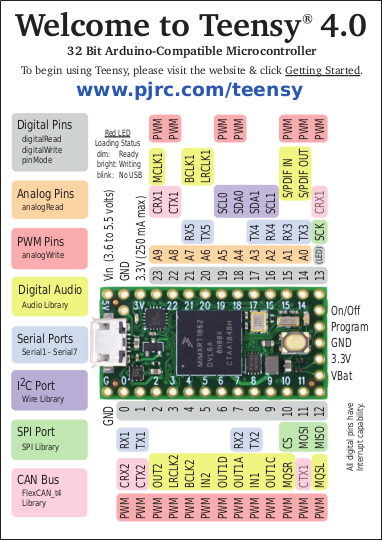
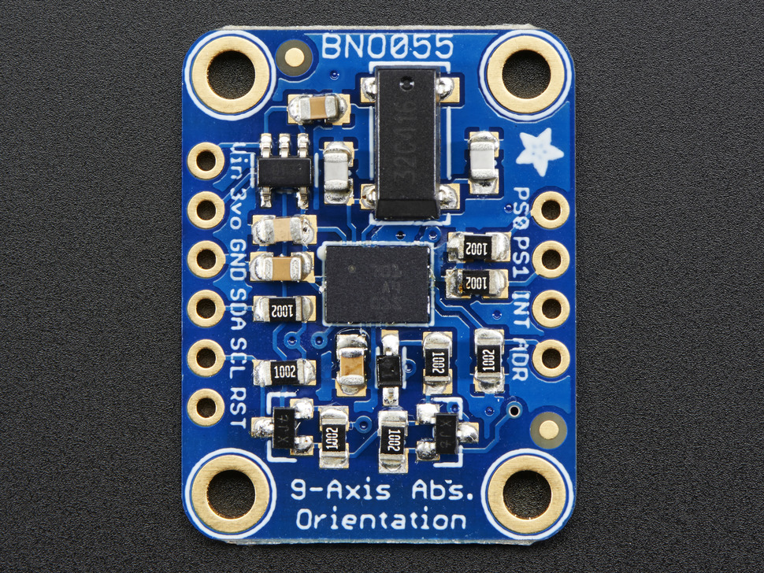
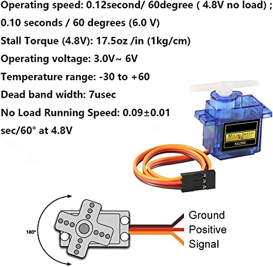
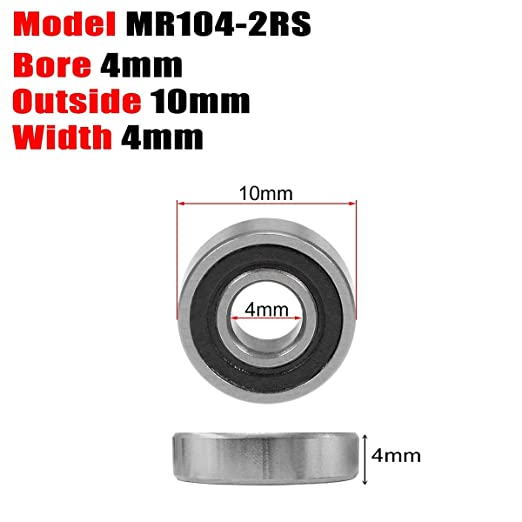
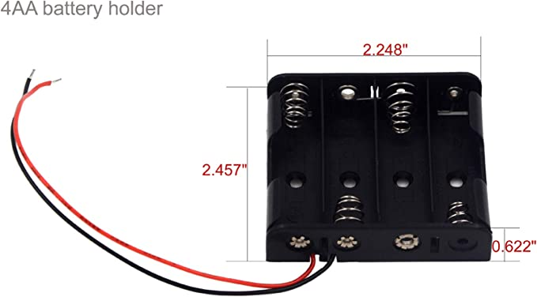

# TVC
## Thrust Vector Controller Summary
* This Repository will contain code that enables my thrust vector controller to work and basic a description of my methodology of its design. My goal is to have a design that can move the motor due using data from the IMU by the end of May 2023.

## Why a TVC?
I am currently a student studying aerospace engineering, and I wanted to start a personal project that was related to aerospace. I chose a TVC because it is a simple enough project that I can complete it during the semester, as well as being relatively cheap.
## Purchased Components
* Micro Controller- [Teensy 4.0](https://www.pjrc.com/store/teensy40.html)
  * 
  * I chose the Teensy 4.0 because its small for factor makes it easy to use and it has great computational power for it's price.
* IMU (Inertia Measurement Unit)- [Adafruit 9-DOF Absolute Orientation IMU Fusion Breakout](https://www.adafruit.com/product/2472)
  * 
  * I chose this breakout board by ada fruit because it includes Bosch's BNO055 which is an incredible sensor. 
* Servos- [SG90](http://www.ee.ic.ac.uk/pcheung/teaching/DE1_EE/stores/sg90_datasheet.pdf)
  * 
  * I chose the SG90 as my servo because of their size and price. I knew I didn't need anything too powerful for my design.
* Mini Ball Bearings- [Ball Bearings](https://www.amazon.com/dp/B07XDZLWHQ?psc=1&ref=ppx_yo2ov_dt_b_product_details)
  * 
  * These are the bearings I am currently using
* Battery holder-[Battery Holder](https://www.amazon.com/dp/B07BNMKNQX?psc=1&ref=ppx_yo2ov_dt_b_product_details)
  * 
  * The battery holder is for powering the Microcontroller, IMU, and Servos.
  
## Designed and 3D Printed components
The remainder of the parts required for the contruction of the TVC will be 3D printed using my Ender 3 S1 by Creality.
This includes a pseudo-engine.
